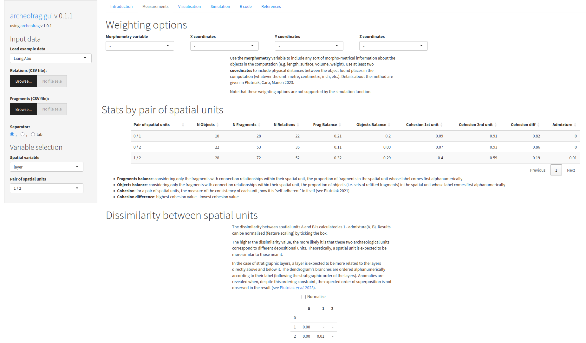

archeofrag.gui: Spatial Analysis in Archaeology from Refitting Fragments (GUI)
=====

An R 'Shiny' application to access the functionalities and datasets of the 'archeofrag' package for spatial analysis in archaeology from refitting data. Quick and seamless exploration of archaeological refitting datasets, focusing on connection relationships only (i.e. physical refits). Features include: built-in documentation and convenient workflow, plot generation and export, R code generation to re-execute the simulations in R and ensure reproducibility, support for parallel computing to speed up computation. A demonstration version of the app is available [online](https://analytics.huma-num.fr/Sebastien.Plutniak/archeofrag).


[](https://www.repostatus.org/#active)
[](https://lifecycle.r-lib.org/articles/stages.html#stable)
[](https://github.com/sebastien-plutniak/archeofrag.gui/actions)
[](https://CRAN.R-project.org/package=archeofrag.gui)
[](https://cran.r-project.org/package=archeofrag.gui)
[](https://sebastien-plutniak.r-universe.dev/ui#package:archeofrag.gui)
[](https://archive.softwareheritage.org/browse/origin/?origin_url=https://github.com/cran/archeofrag.gui)
[](https://www.r-project.org/Licenses/GPL-3)
[](https://doi.org/TODO)

\

\


[](https://analytics.huma-num.fr/Sebastien.Plutniak/archeofrag/)

\

This [R Shiny application](https://analytics.huma-num.fr/Sebastien.Plutniak/archeofrag/) offers a graphic user interface for the [`archeofrag` package](https://github.com/sebastien-plutniak/archeofrag) for spatial analysis from refitting objects in archaeology.

# Contents

- [**Installation**](#installation)
  - [R package](#r-package)
  - [GUI version](#gui-version)
- [**About *archeofrag* **](#about-archeofrag)
- [**Features**](#features)
- [**Community guidelines**](#community-guidelines)
  - [Reporting bugs](#reporting-bugs)
  - [Suggesting changes](#suggesting-changes)
- [**References**](#references)


# Installation

The package can be installed from CRAN with:

```r
install.packages("archeofrag.gui")
```

The development version is available from *GitHub* and can be installed with:

```r
# install.packages("remotes")
remotes::install_github("sebastien-plutniak/archeofrag.gui")
```

The determination of graph planarity in the `archeofrag` package requires the `RBGL` package, available through *Bioconductor*:
This feature is optional, because 
1. even if archaeological fragmentation graphs are [planar](https://en.wikipedia.org/wiki/Planar_graph) in most of the cases, there are exceptions  
2. `RBGL` is a very large package.


```r
if ( ! requireNamespace("BiocManager", quietly = TRUE))
    install.packages("BiocManager")
BiocManager::install("RBGL")
```


# About *archeofrag*

Please refer to the `archeofrag` package documentation on [CRAN](https://github.com/sebastien-plutniak/archeofrag) or [github](https://github.com/sebastien-plutniak/archeofrag) to learn about its methods and functions for spatial and refitting analysis.


# Features

* Exclusive focus on connection relationships (i.e. physical refits)
* Integrated workflow for quick and efficient use of `archeofrag` functionalities
* Convenient access to refitting datasets included in `archeofrag`
* Built-in documentation
* R code generation
* Charts generation and export as SVG
* Interoperability: data can be exported to `archeofrag.gui` from the [*archeoViz*](https://analytics.huma-num.fr/archeoviz/en) application for archaeological spatial data visualisation.


# Community guidelines

## Reporting bugs

If you find a bug, please fill an [issue](https://github.com/sebastien-plutniak/archeofrag/issues) with all the details needed to reproduce it.

## Suggesting changes

Suggestions of changes to `archeofrag.gui` are very welcome. These requests may concern additional functions, changes to documentation, additional examples, new features, etc. 
They can be made by filling an [issue](https://github.com/sebastien-plutniak/archeofrag/issues) and, even better, using pull requests and the [GitHub Fork and Pull
model](https://help.github.com/articles/about-pull-requests).


# Data input

Either load the example data set (refitting data from the Liang Abu rock shelter, Borneo) or upload your data. Use the menu on the left to upload your edges and nodes data as CSV files.

* The relation table must have a row for each refitting relationship, and two columns containing the identifiers of the two fragments.
* The fragments table must have a row for each fragment, the first column contains the fragments identifiers and the second column contains their layer.


# Comparison with simulated data

The observed data can be compared to similar simulated data for two formation hypothesis:

* H1, the archaeological material studied comes from a single deposition episode, within which archaeologists distinguished two subsets;
* H2, the material was deposited during two deposition episodes, that archaeologists could not distinguish due to subsequent perturbations, admixture, and sampling resulting either from human or non-human action

Select the pair of spatial units to compare in the menu, set the number of simulated data sets to generate, and click on the “Run” button. Depending on the size of the data set, the computing time can be long. Charts are generated for various parameters measured on the fragmentation graphs: the value observed on the empirical graph is represented by a vertical bar, the distribution of values for each hypotheses are represented by dark (H1) and light (H2) grey shades.

# References

Please use **Plutniak 2022a** to cite `archeofrag.gui`.


For more details, see the following publications:

* **Plutniak, S. 2021**. “[The Strength of Parthood Ties. Modelling Spatial Units and Fragmented Objects with the TSAR Method – Topological Study of Archaeological Refitting](https://hal.archives-ouvertes.fr/hal-03419952)”, *Journal of Archaeological Science*, 136, p. 105501. DOI: [10.1016/j.jas.2021.105501](https://doi.org/10.1016/j.jas.2021.105501).
* **Plutniak, S. 2022a**. “Archeofrag: an R package for Refitting and Spatial Analysis in Archaeology”, *Journal of Open Source Software*, 7 (75), p. 4335. DOI: [10.21105/joss.04335](https://doi.org/10.21105/joss.04335).
* **Plutniak, S. 2022b**. “[Archeofrag: un package R pour les remontages et l'analyse spatiale en archéologie](https://rzine.fr/publication/20220811_archeofrag_joss)”, *Rzine*.
* **Plutniak, S. 2022c**. “[L'analyse topologique des remontages archéologiques : la méthode TSAR et le package R archeofrag](http://www.prehistoire.org/offres/doc_inline_src/515/0-BSPF_2022_1_2e_partie_Correspondance_PLUTNIAK.pdf)”, *Bulletin de la Société préhistorique française*, 119 (1), p. 110-113.
* **Plutniak, S., J. Caro, C. Manen 2023**. “Four Problems for Archaeological Fragmentation Studies. Discussion and Application to the Taï Cave’s Neolithic Pottery Material (France)”, in A. Sörman et al., *Broken Bodies, Places and Objects. New Perspectives on Fragmentation in Archaeology*, London: Routledge, DOI: [10.4324/9781003350026-10](https://doi.org/10.4324/9781003350026-10).
